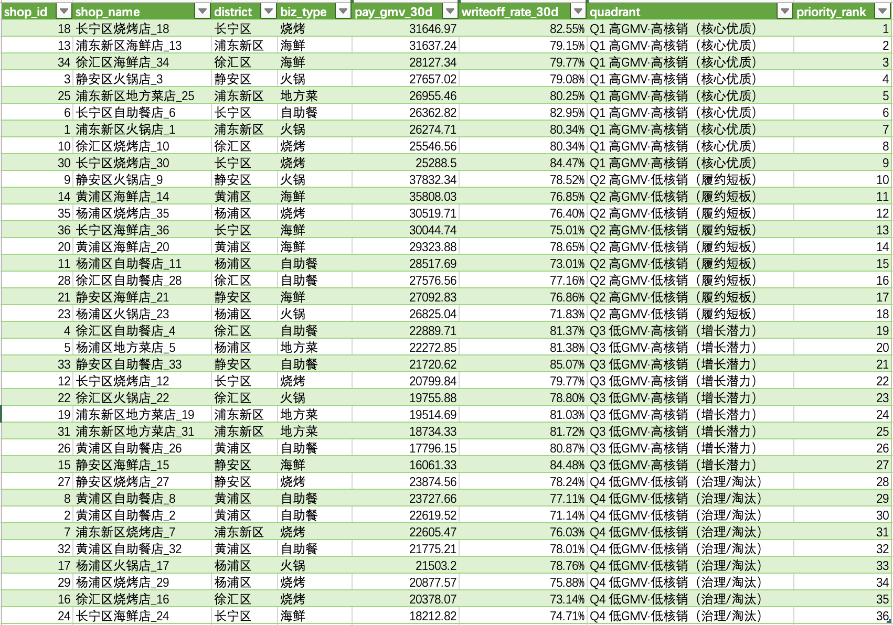
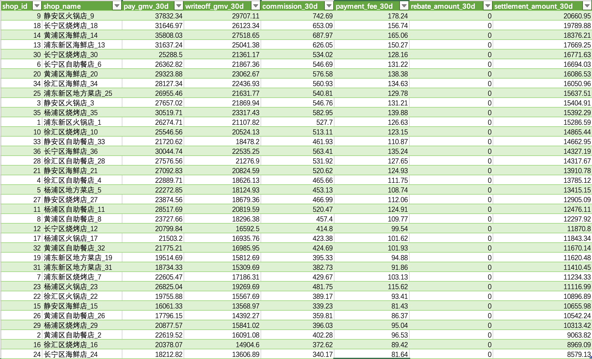

# Douyin Local Service (Restaurant) Portfolio

- Case brief: docs/P1_case_brief.md

This repo contains a simulated Douyin local service dataset (restaurant) and a SQL analysis layer focused on:
- GMV scale and fulfillment quality (writeoff)
- Refund structure
- Channel contribution
- Shop fulfillment segmentation (GMV × writeoff_rate)

## Environment
- MySQL database: `portfolio_db`

## Reproducible quick start
1) Create database: `portfolio_db`
2) Run DDL:
   - `p1_sql_warehouse/ddl/create_table_01-05.sql`
3) Generate data:
   - Run `p1_sql_warehouse/etl/generator.py` to load data into MySQL
4) Run analysis SQL (in order):
   - `p1_sql_warehouse/analysis/SQL01_shop_daily_gmv_quality.sql`
   - `p1_sql_warehouse/analysis/SQL02_channel_writeoff_rate.sql`
   - `p1_sql_warehouse/analysis/SQL03_channel_aov.sql`
   - `p1_sql_warehouse/analysis/SQL04_refund_rate_structure.sql`
   - `p1_sql_warehouse/analysis/SQL05_channel_shop_gmv_contribution.sql`
   - `p1_sql_warehouse/analysis/SQL06_shop_fulfillment_quadrant.sql`
   - `p1_sql_warehouse/analysis/SQL07_q2_root_cause_writeoff_delay_refund.sql`
   - `p1_sql_warehouse/analysis/SQL08_channel_funnel_traffic_to_pay.sql`
   - `p1_sql_warehouse/analysis/SQL09_sku_pricing_activity_effect.sql`
   - `p1_sql_warehouse/analysis/SQL10_agreement_vs_non_agreement_settlement.sql`
   - `p1_sql_warehouse/analysis/SQL11_chain_vs_single_shop_performance.sql`
   - `p1_sql_warehouse/analysis/SQL12_settlement_quality.sql`

## Results snapshot
- SQL06 Shop fulfillment quadrant (GMV × writeoff_rate): `docs/results/SQL06_shop_fulfillment_quadrant.csv`
- SQL12 Settlement quality (commission/fee/rebate/settlement): `docs/results/SQL12_settlement_quality.csv`

### SQL06 — Shop fulfillment quadrant (GMV × writeoff_rate)

### SQL12 — Settlement quality (commission/fee/rebate/settlement)

